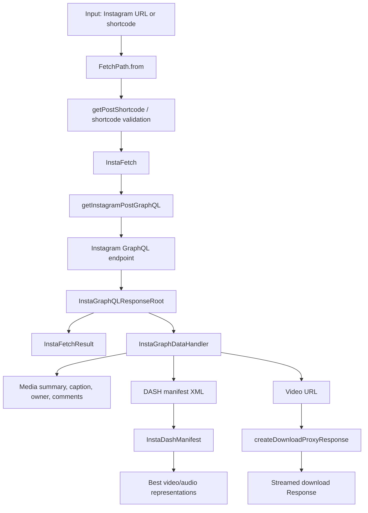

# Instafetch SDK

## 📖 Overview

Instafetch is a TypeScript SDK for resolving Instagram post or Reel shortcodes,
requesting Instagram's web GraphQL post data, extracting video/media metadata,
parsing DASH MPD manifests, and preparing backend-friendly download responses.

This SDK was adapted from the original
[`riad-azz/instagram-video-downloader`](https://github.com/riad-azz/instagram-video-downloader)
project by `riad-azz`, which was a Next.js Instagram video downloader app.

The current repository is packaged as an ESM Node library. The live code exports
SDK classes and reusable request helpers from `src/index.ts` through
`src/main.ts`, then compiles them to `dist/` with TypeScript.

> Disclaimer: Downloading media from Instagram may violate Instagram's Terms of
> Service or other rights. Use this library only for content you own, have
> permission to access, or are otherwise legally allowed to process.

## ✨ Features

- Extracts Instagram shortcodes from `/p/{shortcode}` and `/reel/{shortcode}`
  URLs.
- Accepts either full Instagram URLs or raw shortcode strings.
- Calls Instagram's hard-coded web GraphQL endpoint for shortcode media.
- Supports custom headers, user agent, cookie, injected `fetch`, and injected
  requester implementations.
- Returns raw GraphQL responses, convenience result objects, or higher-level
  media handlers.
- Provides typed helpers for video URL, display image, caption, owner, tagged
  users, comments, likes, dimensions, timestamps, and music attribution.
- Parses embedded DASH MPD manifests into video/audio representations.
- Selects best video/audio representations by resolution and bandwidth.
- Supports batch fetches with fail-fast or settled-result workflows.
- Provides framework-agnostic helpers for API-style shortcode validation and
  download proxy streaming.
- Includes typed response models for the Instagram GraphQL shape used by this
  SDK.
- Includes local tests for DASH parsing, shortcode validation, request option
  merging, batch settling, and response handling.

## 🚀 Installation

Clone or enter the repository:

```bash
cd instafetch
```

Install dependencies:

```bash
npm install
```

Build the package:

```bash
npm run build
```

The package build uses `tsconfig.build.json`, which emits a lean `dist/`
artifact for npm: JavaScript files plus TypeScript declarations, without source
maps or declaration maps.

Run the stable SDK checks:

```bash
npm test
```

The package entry is configured as:

```json
{
  "main": "./dist/index.js",
  "types": "./dist/index.d.ts",
  "exports": {
    ".": {
      "types": "./dist/index.d.ts",
      "import": "./dist/index.js"
    }
  }
}
```

## 🛠️ Usage

### Fetch One Instagram Video

```ts
import { FetchPath, InstaFetch } from "instafetch";

const path = FetchPath.from("https://www.instagram.com/reel/DYWTgB7Ta8p/");
const client = new InstaFetch(path);

const result = await client.fetchOne();

console.log(result.videoUrl);
console.log(result.caption);
console.log(result.owner?.username);
```

### Use a Raw Shortcode

```ts
import { FetchPath, InstaFetch } from "instafetch";

const client = new InstaFetch(FetchPath.asShortcode("DYWTgB7Ta8p"));
const response = await client.submitRequest();

console.log(response.data.xdt_shortcode_media?.video_url);
```

### Provide User Agent, Cookie, Headers, or Custom Fetch

```ts
import { FetchPath, InstaFetch } from "instafetch";

const client = new InstaFetch(FetchPath.asShortcode("DYWTgB7Ta8p"), {
  userAgent: "Mozilla/5.0 ...",
  cookie: "sessionid=...",
  headers: {
    "Accept-Language": "en-US,en;q=0.9",
  },
  fetchImpl: fetch,
});

const result = await client.fetchOne();
```

### Read Media with the Handler API

```ts
import { InstaGraphDataHandler } from "instafetch";

const handler = InstaGraphDataHandler.from(result.raw);

const summary = handler.toSummary();
const bestImage = handler.getBestDisplayImage();
const bestVideo = handler.getBestVideoUrl();
const audio = handler.getAudioUrl();

console.log(summary);
console.log({ bestImage, bestVideo, audio });
```

### Parse DASH MPD Manifests

```ts
import { InstaDashManifest } from "instafetch";

const manifestXml = result.getHandler().getDashManifest();

if (manifestXml) {
  const dash = InstaDashManifest.fromXml(manifestXml);

  console.log(dash.getVideoRepresentations());
  console.log(dash.getAudioRepresentations());
  console.log(dash.getBestVideo()?.baseUrl);
  console.log(dash.getBestAudio()?.baseUrl);
}
```

### Batch Requests

```ts
import { FetchPath, InstaFetch } from "instafetch";

const client = new InstaFetch([
  FetchPath.asShortcode("abc123"),
  "https://www.instagram.com/reel/xyz789/",
]);

const settled = await client.settleAllRequests();

for (const item of settled) {
  if (item.ok) {
    console.log(item.path.shortcode, item.result.videoUrl);
  } else {
    console.error(item.path.shortcode, item.error);
  }
}
```

### API-Style Shortcode Validation

```ts
import { getInstagramPostByShortcode } from "instafetch";

const result = await getInstagramPostByShortcode("DYWTgB7Ta8p");

if (result.status === 200) {
  console.log(result.data.xdt_shortcode_media.video_url);
} else {
  console.error(result.error, result.message);
}
```

### Create a Download Proxy Response

```ts
import { createDownloadProxyResponse } from "instafetch";

const response = await createDownloadProxyResponse({
  url: "https://cdn.example.com/video.mp4",
  filename: "instagram-video.mp4",
});

return response;
```

`createDownloadProxyResponse` requires an HTTPS URL, fetches the remote media,
and streams it back with `Content-Disposition`, `Content-Type`, and
`Content-Length` when available.

## 📦 Technologies

- TypeScript with `strict` mode.
- Node.js ESM package output.
- NodeNext module and module resolution.
- Built-in `fetch`, `Response`, `Headers`, `ReadableStream`, and `FormData`
  types.
- `querystring` for form-encoded Instagram GraphQL request bodies.
- `tsx` for TypeScript test scripts.
- `@types/node` for Node type definitions.
- `npm` package metadata with `dist/`, `README.md`, and `LICENSE.md` as package
  files.

Runtime dependencies: none.

Development dependencies:

- `typescript`
- `tsx`
- `@types/node`

## 🔧 Configuration

There are no required environment variables in the current source tree.

`InstaFetch` accepts these options:

| Option | Purpose |
| --- | --- |
| `headers` | Extra headers merged into the Instagram GraphQL request. |
| `userAgent` | Convenience value for the `User-Agent` header. |
| `cookie` | Convenience value for the `Cookie` header. |
| `fetchImpl` | Custom fetch implementation for tests, runtimes, or instrumentation. |
| `requestConfig` | Extra `RequestInit` values plus optional `fetchImpl`. |
| `requester` | Fully custom requester replacing the default GraphQL call. |

The default Instagram GraphQL integration is implemented in
`src/api/instagram/p/[shortcode]/utils.ts`. It hard-codes the GraphQL endpoint,
request body fields, `doc_id`, app ID, CSRF/LSD-style headers, and mobile browser
user agent used by the current request flow.

The download proxy helper accepts a full HTTPS URL. It validates only the
`https://` scheme and does not whitelist hosts.

## ✅ Requirements

- Node.js 18 or newer.
- npm.
- Network access for live Instagram GraphQL requests.
- TypeScript build support through the repository dev dependencies.

Verified during repository inspection:

- `npm run build` passes.
- `npm test` passes.
- `npm run test:sdk` passes.
- `npm run test:main` performs a live Instagram request and passed in the
  inspected environment.

## 🗂️ Repository Structure

Complete tracked repository structure:

```text
instafetch/
├── .gitignore
├── AGENTS.md
├── LICENSE.md
├── README.md
├── package-lock.json
├── package.json
├── scripts/
│   ├── clean.mjs
│   └── smoke.mjs
├── tsconfig.build.json
├── tsconfig.json
├── src/
│   ├── index.ts
│   ├── main.ts
│   ├── api/
│   │   ├── download-proxy/
│   │   │   └── route.ts
│   │   └── instagram/
│   │       └── p/
│   │           └── [shortcode]/
│   │               ├── route.ts
│   │               └── utils.ts
│   ├── features/
│   │   └── api/
│   │       ├── hooks/
│   │       │   └── use-fetch.ts
│   │       ├── requests/
│   │       │   └── instagram.ts
│   │       ├── http-codes.ts
│   │       └── utils.ts
│   ├── lib/
│   │   └── utils.ts
│   ├── sdk/
│   │   ├── errors.ts
│   │   ├── fetch-path.ts
│   │   ├── insta-dash-manifest.ts
│   │   ├── insta-fetch-result.ts
│   │   ├── insta-fetch.ts
│   │   └── insta-graph-data-handler.ts
│   └── types/
│       ├── fetch-params.ts
│       ├── graph-path.ts
│       ├── insta-path-constants.ts
│       ├── request-config.ts
│       ├── request/
│       │   ├── graphql-request.enums.ts
│       │   ├── graphql-request.types.ts
│       │   ├── index.ts
│       │   └── post-request.types.ts
│       └── response/
│           ├── caption.types.ts
│           ├── comment.types.ts
│           ├── connection.types.ts
│           ├── extensions.types.ts
│           ├── index.ts
│           ├── media.types.ts
│           ├── root.types.ts
│           └── user.types.ts
└── test/
    └── scripts/
        ├── main.test.ts
        └── sdk-features.test.ts
```

Current local/generated directories observed in the checkout but not tracked:

```text
.agent/                 Local agent/tooling state.
.idea/                  JetBrains IDE metadata.
.next/                  Ignored Next.js build artifact from prior/current local work.
dist/                   TypeScript build output consumed by package exports.
log/snapshots/          Local test fixture storage; includes video-manifest.xml.
node_modules/           Installed npm dependencies.
next-env.d.ts           Ignored Next.js type shim from prior/current local work.
tsconfig.tsbuildinfo    TypeScript incremental build metadata.
```

File and folder purpose:

| Path | Purpose |
| --- | --- |
| `src/index.ts` | Package entry that re-exports `src/main.ts`. |
| `src/main.ts` | Public SDK export surface. |
| `src/sdk/fetch-path.ts` | Converts URLs or raw shortcodes into validated `FetchPath` instances. |
| `src/sdk/insta-fetch.ts` | Main fetch orchestrator for single and batch Instagram requests. |
| `src/sdk/insta-fetch-result.ts` | Convenience wrapper around raw responses and handler-derived properties. |
| `src/sdk/insta-graph-data-handler.ts` | High-level reader for GraphQL media data and derived metadata. |
| `src/sdk/insta-dash-manifest.ts` | DASH MPD parser and best representation selector. |
| `src/sdk/errors.ts` | Custom SDK error hierarchy. |
| `src/api/instagram/p/[shortcode]/utils.ts` | Low-level Instagram GraphQL POST request builder. |
| `src/api/instagram/p/[shortcode]/route.ts` | API-style shortcode fetch and validation helper. |
| `src/api/download-proxy/route.ts` | Framework-agnostic HTTPS media streaming response helper. |
| `src/features/api/hooks/use-fetch.ts` | Fetch wrapper that injects locale and JSON content headers. |
| `src/features/api/requests/instagram.ts` | Creates a requester for `/api/instagram/p/{shortcode}` endpoints. |
| `src/features/api/utils.ts` | JSON response wrapper that normalizes status/data handling. |
| `src/features/api/http-codes.ts` | HTTP status enum used by API helpers. |
| `src/lib/utils.ts` | Object path utilities and Instagram shortcode parsing helpers. |
| `src/types/graph-path.ts` | Reusable selector paths for Instagram response lookup. |
| `src/types/insta-path-constants.ts` | Enum constants for GraphQL response field names. |
| `src/types/request/` | Request method/header/config typing for GraphQL integration. |
| `src/types/response/` | Instagram GraphQL response model interfaces. |
| `scripts/clean.mjs` | Removes generated build artifacts before TypeScript emits fresh output. |
| `scripts/smoke.mjs` | Offline package smoke test that imports `dist/` and validates core SDK behavior. |
| `tsconfig.build.json` | Publish-oriented TypeScript config that excludes local folders and omits map files. |
| `tsconfig.json` | Base TypeScript config used by the build config. |
| `test/scripts/sdk-features.test.ts` | Offline SDK behavior test using fixture data and mocked requests. |
| `test/scripts/main.test.ts` | Live smoke-style Instagram request script. |

## 🔗 Flow Chart



## 📄 Documentation

Important implementation entry points:

- `src/main.ts` lists the public export surface.
- `src/sdk/insta-fetch.ts` is the main SDK orchestration class.
- `src/sdk/insta-graph-data-handler.ts` contains most media-reading helpers.
- `src/sdk/insta-dash-manifest.ts` documents the parsed DASH representation
  shape through its exported types.
- `src/api/instagram/p/[shortcode]/utils.ts` is the external Instagram GraphQL
  integration point.
- `src/api/download-proxy/route.ts` is the streaming download helper.
- `test/scripts/sdk-features.test.ts` shows mocked usage patterns and expected
  behavior.

The repository also contains `AGENTS.md`, which documents that this project is
SDK-only and should stay framework-agnostic unless the project direction
explicitly changes.

## 🤝 Contributing

1. Create a branch for the change.
2. Install dependencies with `npm install`.
3. Keep public exports centralized in `src/main.ts`.
4. Add or update tests under `test/scripts/` for SDK behavior changes.
5. Run `npm run build`.
6. Run `npm test`.
7. Use `npm run test:main` only when a live Instagram network check is intended.
8. Reconcile package metadata before publishing if changing license, exports, or
   generated package contents.

Recommended maintenance follow-ups:

- Consider moving route-shaped helper files under SDK-oriented names before a
  public npm release.
- Decide how much of the Instagram GraphQL request metadata should be public
  configuration versus documented private integration detail.
- Add CI that runs `npm test`, `npm run test:sdk`, and `npm pack --dry-run`.

## ❤️ Acknowledgements

- This SDK was adapted from
  [`riad-azz/instagram-video-downloader`](https://github.com/riad-azz/instagram-video-downloader)
  by `riad-azz`.
- Original license notice credits Riadh Azzoun.
- Instagram GraphQL response field names and DASH manifest fields come from the
  shape returned by Instagram's web endpoints.
- The SDK uses platform web APIs available in modern Node.js runtimes.

## 📝 Changelog

### 1.0.0

- Initial SDK commit (`24cffc5`).
- Added TypeScript ESM package configuration.
- Added shortcode parsing and `FetchPath`.
- Added Instagram GraphQL request helper.
- Added `InstaFetch` single, batch, and settled request flows.
- Added `InstaGraphDataHandler` for media metadata extraction.
- Added DASH MPD parsing and representation selection.
- Added download proxy response helper.
- Added typed Instagram response models.
- Added SDK feature tests and a live Instagram test script.
- Added offline smoke testing, clean builds, MIT package metadata, and
  SDK-only repository guidance.

## ⚖️ License

See `LICENSE.md`.
